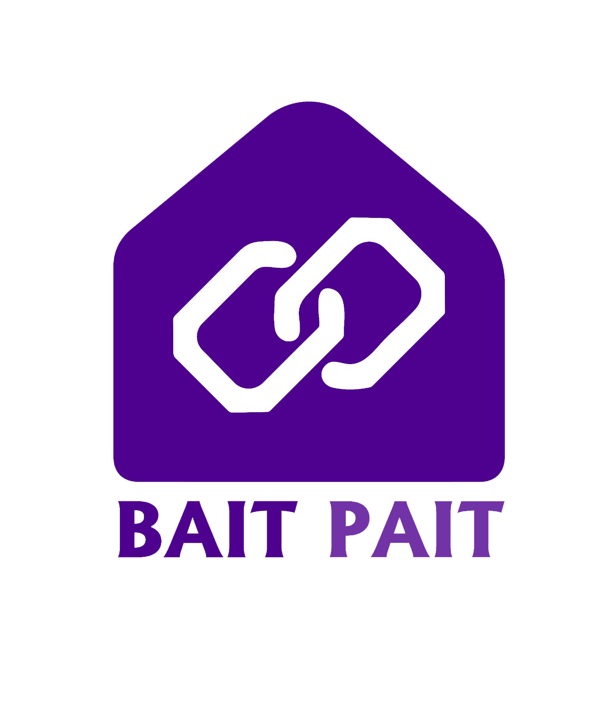

<p align="center">
  <a href="#bait-pait-software">
    
  </a>
</p>

<p align="center">
  <strong>بيت البرمجيات وتكنولوجيا المعلومات</strong><br>
  إدارة مصطفى البستنجي
</p>

<p align="center">
  
  
  
  
  
  
</p>

## 🏥 نظام الغد الطبي - إدارة مركز جراحة العيون

نظام إدارة طبية شامل لمركز الغد لجراحة العيون والليزك، مطور بإطار عمل Laravel 11 بواسطة **بيت البرمجيات وتكنولوجيا المعلومات**.

### 📋 الميزات الرئيسية
- **📊 إدارة المرضى** - سجلات شاملة وتاريخ طبي مفصل
- **📅 جدولة المواعيد** - نظام متقدم لحجز وإدارة الزيارات
- **🔪 العمليات الجراحية** - تقييم ما قبل العملية وتتبع العمليات
- **📁 إدارة الملفات** - رفع وتخزين آمن للوثائق الطبية
- **💰 نظام الفواتير** - فوترة تلقائية وتتبع المدفوعات
- **🔐 الأدوار والصلاحيات** - نظام تحكم متقدم في الوصول

### 🔗 روابط مهمة
- **[📚 المواصفات التقنية الكاملة](SYSTEM_SPECIFICATIONS.md)** - تفاصيل فنية شاملة
- **[🇸🇦 دليل التثبيت بالعربية](README_AR.md)** - تعليمات التثبيت المفصلة
- **[📖 دليل التثبيت التقني](docs/INSTALLATION_GUIDE_MAC.md)** - إرشادات التثبيت الكاملة

### 🚀 البدء السريع
```bash
# تحميل المشروع
git clone https://github.com/baiitpait/almezanSystem.git
cd almezanSystem

# تثبيت التبعيات
composer install && npm install

# إعداد البيئة
cp .env.example .env && php artisan key:generate

# إعداد قاعدة البيانات
php artisan migrate --seed

# تشغيل الخادم
php artisan serve
```

---

## 🏢 عن الشركة

### بيت البرمجيات وتكنولوجيا المعلومات
**إدارة مصطفى البستنجي**

نحن شركة متخصصة في تطوير البرمجيات والحلول التقنية المتقدمة، نقدم خدمات شاملة تشمل:

- **💻 تطوير تطبيقات الويب والموبايل**
- **🗄️ تصميم وتطوير قواعد البيانات**
- **🔒 أنظمة الأمان والحماية**
- **📊 حلول الأعمال الذكية**
- **🏥 أنظمة إدارة المستشفيات والعيادات**

### 📞 معلومات التواصل
- **📧 البريد الإلكتروني:** info@baitpait.com
- **🌐 الموقع الإلكتروني:** [baitpait.com](https://baitpait.com)
- **📱 الهاتف:** +97059981475

---

## 🛠️ التقنيات المستخدمة

### Backend
- **Laravel 11** - إطار عمل PHP متقدم
- **PHP 8.2+** - أحدث إصدارات PHP
- **MySQL 8.0+** - قاعدة بيانات قوية وموثوقة

### Frontend
- **Livewire 3.x** - إطار عمل تفاعلي للواجهات
- **Tailwind CSS 3.x** - نظام تصميم حديث
- **DaisyUI** - مكتبة مكونات جاهزة
- **Alpine.js** - JavaScript تفاعلي

### أدوات التطوير
- **Composer** - إدارة تبعيات PHP
- **NPM** - إدارة تبعيات JavaScript
- **Vite** - أداة بناء سريعة
- **Git** - نظام التحكم في الإصدارات

---

## 📈 إحصائيات المشروع

| المقياس | القيمة |
|---------|--------|
| 📁 عدد الملفات | 264+ ملف |
| 📝 سطور الكود | 43,000+ سطر |
| 🗄️ جداول قاعدة البيانات | 25+ جدول |
| 🔄 ملفات الهجرة | 65+ ملف |
| 🎯 مكونات Livewire | 20+ مكون |
| 📚 ملفات التوثيق | 30+ ملف |

---

## 🎯 مراحل التطوير

### ✅ المرحلة الأولى (مكتملة)
- [x] إدارة شاملة للمرضى
- [x] نظام المواعيد المتقدم
- [x] تقييم ما قبل العملية الجراحية
- [x] رفع وإدارة الملفات الطبية
- [x] نظام الفواتير والمدفوعات
- [x] لوحة تحكم إحصائية

### 🚧 المرحلة الثانية (قريباً)
- [ ] تطبيق الموبايل
- [ ] تحليلات متقدمة
- [ ] دعم عدة لغات
- [ ] تكامل مع الأجهزة الطبية

### 🔮 المرحلة الثالثة (مستقبلية)
- [ ] ذكاء اصطناعي للتشخيص
- [ ] telemedicine
- [ ] تطبيقات الواقع المعزز

---

## 📋 متطلبات التشغيل

### الحد الأدنى للمتطلبات
- **المعالج:** Dual-core 2.4 GHz
- **الذاكرة:** 4GB RAM
- **التخزين:** 1GB مساحة فارغة
- **النظام:** Windows 10+ أو macOS 12+ أو Ubuntu 20.04+

### المتطلبات البرمجية
- **PHP:** 8.2.12 أو أحدث
- **MySQL/MariaDB:** 8.0 أو أحدث
- **Composer:** أحدث إصدار
- **Node.js & NPM:** أحدث إصدار

---

## 🔒 الأمان والحماية

### ميزات الأمان المطبقة
- ✅ **تشفير كامل للبيانات**
- ✅ **حماية CSRF**
- ✅ **نظام الأدوار والصلاحيات**
- ✅ **التحقق من صحة البيانات**
- ✅ **حماية من SQL Injection**
- ✅ **تشفير كلمات المرور**

### نسخ احتياطي تلقائي
- **يومي:** نسخ احتياطية لقاعدة البيانات
- **أسبوعي:** نسخ احتياطية كاملة للملفات
- **سحابي:** تخزين آمن في السحابة

---

## 🤝 المساهمة والتطوير

نرحب بالمساهمات من المطورين المحترفين! للمشاركة في تطوير المشروع:

### طرق المساهمة
- **🐛 الإبلاغ عن الأخطاء** - استخدم Issues في GitHub
- **💡 اقتراح ميزات جديدة** - شارك أفكارك
- **🔧 تطوير الكود** - أرسل Pull Requests
- **📚 تحسين التوثيق** - ساعد في توثيق المشروع

### متطلبات المساهمين
```bash
# التأكد من جودة الكود
composer run-script test
npm run test

# فحص أسلوب الكتابة
./vendor/bin/pint --test

# فحص الأمان
./vendor/bin/security-checker
```

---

## 📄 الترخيص

هذا المشروع مرخص تحت رخصة **MIT License**.

**© 2025 بيت البرمجيات وتكنولوجيا المعلومات - إدارة مصطفى البستنجي**

---

## 📞 الدعم الفني

### قنوات الدعم
- **📧 البريد الإلكتروني:** support@baitpait.com
- **💬 GitHub Issues:** [إبلاغ عن مشاكل](https://github.com/baiitpait/almezanSystem/issues)
- **📱 الهاتف:** +966 XX XXX XXXX

### أوقات الدعم
- **السبت - الخميس:** 9:00 ص - 6:00 م
- **الجمعة:** 4:00 م - 10:00 م
- **استجابة:** خلال 24 ساعة

---

## 🔗 روابط مفيدة

- **📖 التوثيق الكامل:** [SYSTEM_SPECIFICATIONS.md](SYSTEM_SPECIFICATIONS.md)
- **🚀 دليل التثبيت:** [docs/INSTALLATION_GUIDE_MAC.md](docs/INSTALLATION_GUIDE_MAC.md)
- **🇸🇦 التثبيت بالعربية:** [README_AR.md](README_AR.md)
- **🌐 موقع الشركة:** [baitpait.com](https://baitpait.com)

---

<p align="center">
  <strong>تم التطوير بكل ❤️ من قبل فريق بيت البرمجيات وتكنولوجيا المعلومات</strong>
</p>
